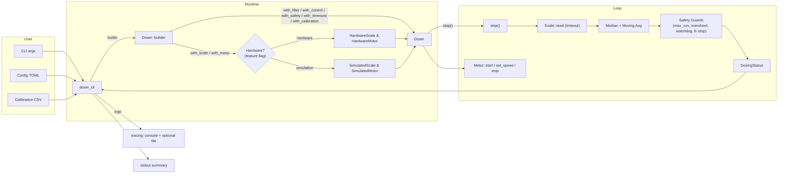
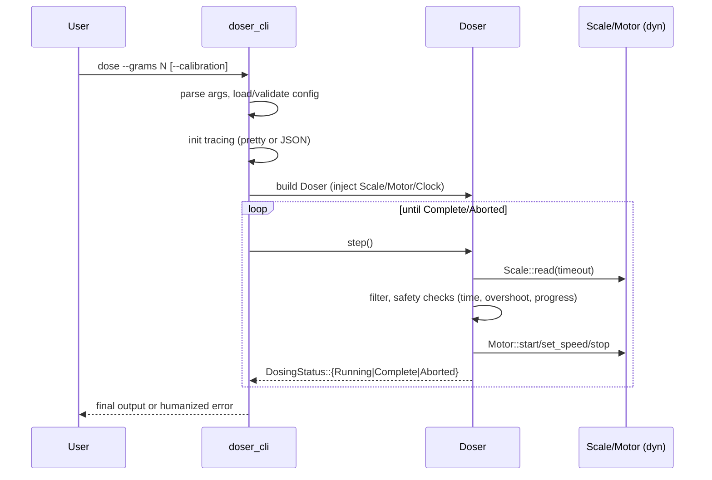
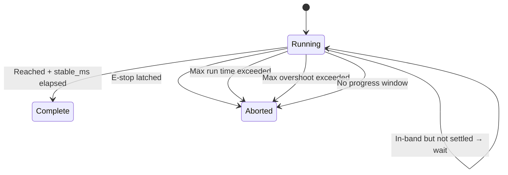

# Doser Architecture

This document describes the architecture of the Doser workspace, its crates, data flow, key Rust features used, and the safety invariants enforced by the core dosing logic.

## Workspace overview

The repository is a Rust workspace composed of multiple crates:

- doser_core: Hardware‑agnostic dosing logic (control loop, filtering, calibration, safety checks, state machine, builder).
- doser_traits: Thin abstraction layer defining hardware traits: Scale and Motor, plus a Clock abstraction (MonotonicClock by default).
- doser_hardware: Hardware backends and a simulation backend. Includes an E‑stop checker factory for GPIO (feature‑gated) and simulated motor/scale. Provides:
  - HardwareScale wrapping an HX711 driver with timeout reads.
  - HardwareMotor (Raspberry Pi step/dir with optional active‑low EN pin) driven from a background thread up to ~5 kHz.
- doser_config: Typed configuration loader (TOML) and calibration CSV loader.
- doser_cli: CLI application that wires config, hardware or sim, and runs a dosing session. Initializes logging.
- doser_ui: Placeholder crate for higher‑level UI integrations.

Support files:

- examples/: Quick start and custom strategy examples.
- .github/workflows/: CI for fmt, clippy, tests, and hardware feature compile checks.

## High‑level data flow

## Core (doser_core)

The `Doser` struct implements the dosing control loop. It is built via a `DoserBuilder`, which injects:

- Scale and Motor implementations (via `doser_traits`).
- FilterCfg, ControlCfg, SafetyCfg, Timeouts.
- Calibration (linear mapping counts→grams, plus tare counts).
- Optional E‑stop checker callback (debounced and latched until begin()).
- Optional Clock (for deterministic time‑based tests; default `MonotonicClock`).
- Type‑state builder with validation in `try_build()`.

Completion logic:

- Asymmetric stop threshold: stop motor once `w + epsilon_g >= target`.
- Stability uses hysteresis: require `|err| <= hysteresis_g` for `stable_ms`.

### Time and determinism

- A `Clock` trait provides monotonic time and helpers: `now() -> Instant`, `sleep(Duration)`, and `ms_since(epoch: Instant) -> u64`.
- `MonotonicClock` is the default; tests can inject `TestClock`.

### Safety invariants

- E‑stop debounce + latch until `begin()`.
- Hard max runtime, max overshoot guard, and a no‑progress watchdog (`no_progress_epsilon_g` over `no_progress_ms`).

## Config (doser_config)

- Typed TOML with validation in `Config::validate()` and sensible defaults.
- Strict calibration CSV loader: exact header `raw,grams`; at least 2 rows; raw values must be strictly monotonic; OLS fit computes `scale_factor` and `offset` (tare counts).

## CLI (doser_cli)

- Clap CLI: `dose` and `self-check`.
- Logging via tracing + EnvFilter; console pretty or JSON; optional file with rotation and a WorkerGuard kept in a OnceLock.
- Maps core errors to human‑friendly messages on stderr.

## Error model

- Libraries use `thiserror` for domain errors; the CLI and app edges use `eyre` for ergonomic propagation and context.

## Testing

- Unit tests in `doser_core` with `rstest` and deterministic clocks.
- CLI integration tests use `assert_cmd` and validate stderr for errors.

## Diagrams

Sequence: dose command → control loop

Core state machine

