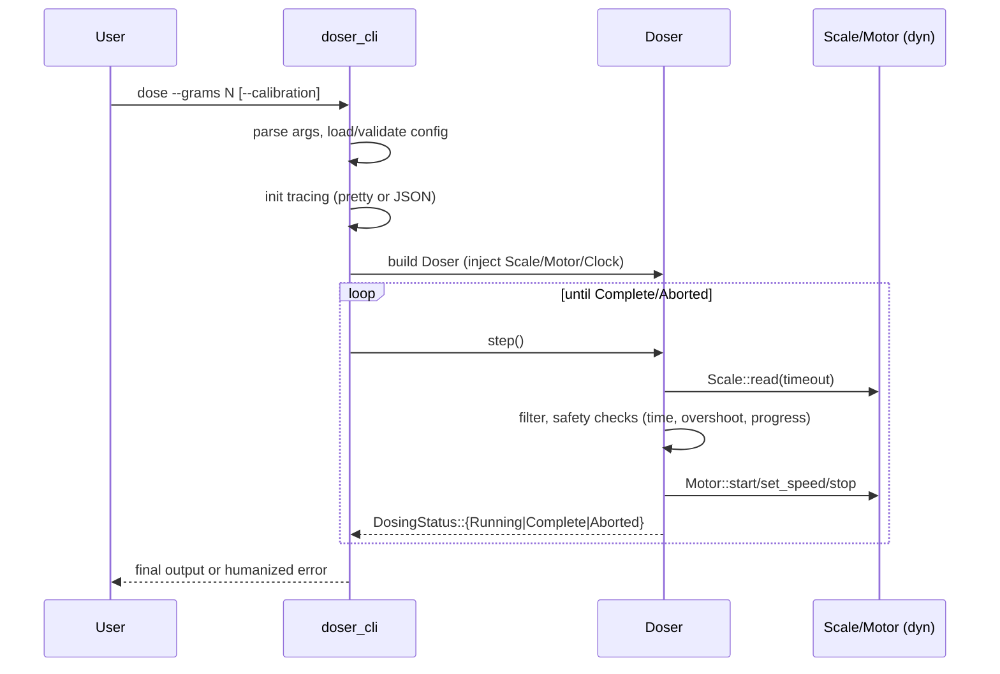
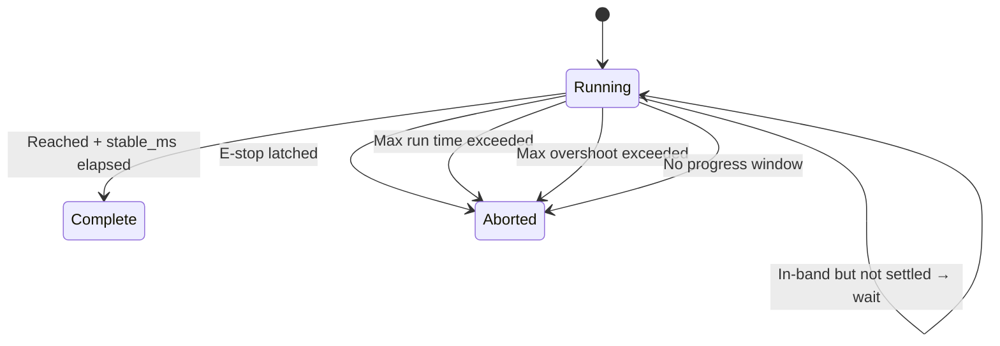

# Rust Primer (Detailed) for the Doser Workspace

This document is a deep, teachable guide to the Rust concepts actually used in this repository, with concrete references to files and symbols, rationale for each choice, alternatives considered, and trade‑offs. It complements and expands the existing docs/RUST_PRIMER.md.

- Audience: Engineers preparing for a code review or viva, new contributors looking for a rigorous walkthrough.
- Scope: Only concepts present in this repo; each concept ties back to real decisions.

---

## Executive Summary

This system implements a dosing controller that reads a scale, drives a motor, and enforces safety guards (max runtime, overshoot, no‑progress, E‑stop). The codebase is a Rust workspace of multiple crates layered for separation of concerns:

- doser_traits: shared traits for hardware (Scale, Motor) and a Clock abstraction.
- doser_core: control loop, builders, filtering, safety checks, typed errors.
- doser_hardware: hardware backends (Raspberry Pi GPIO + HX711) and a simulation backend.
- doser_cli: user‑facing CLI, config parsing, logging, calibration loading, error humanization.
- doser_config, doser_ui: typed config and stub UI crate.

Key Rust choices serve the product goals:

- Safety and determinism: Monotonic time via a Clock trait (doser_traits/src/clock.rs) and saturating arithmetic; no panics on time underflow. Safety guards encoded as explicit checks returning typed errors.
- Hardware abstraction & testability: Trait objects (Scale, Motor, Clock) injected via a builder enable swapping simulation vs hardware and deterministic clocks in tests. Feature flags compile out hardware on non‑Pi CI.
- Error ergonomics with structure: Library crates define typed domain errors (thiserror); the CLI uses eyre::Report to compose context and then "humanizes" messages for operators.
- Concurrency where it matters: The hardware motor uses a background thread, Arc<Atomic\*> for control, and a shutdown channel; the rest stays single‑threaded and predictable.

60‑second pitch to a professor:

- It’s a small real‑time‑ish controller built in Rust for safety and determinism. We abstract hardware behind traits (Scale, Motor) so the core logic is pure and testable. Time is a first‑class dependency (Clock) to make tests deterministic and avoid SystemTime pitfalls. Typed errors model domain problems; the CLI maps them to actionable messages. Feature flags select real GPIO on a Pi; CI uses the sim backend. The state machine is explicit (DosingStatus) and safety checks use saturating time arithmetic, making failure modes predictable and testable.

---

## Table of Contents

- [Executive Summary](#executive-summary)
- [Concept Deep Dives](#concept-deep-dives)
  - [Ownership, Borrowing, Lifetimes](#ownership-borrowing-lifetimes)
  - [Mutability & Interior Mutability](#mutability--interior-mutability)
  - [Error Handling (eyre + thiserror)](#error-handling-eyre--thiserror)
  - [Enums & State Machines](#enums--state-machines)
  - [Traits, Generics, and Trait Objects](#traits-generics-and-trait-objects)
  - [Module System & Visibility](#module-system--visibility)
  - [Feature Flags & Conditional Compilation](#feature-flags--conditional-compilation)
  - [Builder Pattern & Type‑State](#builder-pattern---type-state)
  - [Collections, Iterators, Saturating Arithmetic](#collections-iterators-saturating-arithmetic)
  - [Time & Determinism (Clock, Instant)](#time--determinism-clock-instant)
  - [Logging & Tracing](#logging--tracing)
  - [Serde, TOML & CSV](#serde-toml--csv)
  - [Testing Strategy (rstest, assert_cmd)](#testing-strategy-rstest-assert_cmd)
  - [Macros Used](#macros-used)
  - [Concurrency & Threading](#concurrency--threading)
  - [Constants vs Magic Numbers](#constants-vs-magic-numbers)
- [By‑File Walkthrough](#by-file-walkthrough)
- [Call Graph & Sequences (Mermaid)](#call-graph--sequences-mermaid)
- [Pitfalls We Avoided](#pitfalls-we-avoided)
- [Comparative Alternatives](#comparative-alternatives)
- [FAQ / Viva Prep](#faq--viva-prep)
- [Mini Exercises](#mini-exercises)
- [Glossary](#glossary)

---

## Concept Deep Dives

### Ownership, Borrowing, Lifetimes

Where used here:

- Moving hardware into core: doser_core/src/lib.rs: `Doser { scale: Box<dyn Scale>, motor: Box<dyn Motor>, ... }`
- Borrowing in methods like `Doser::filter_cfg(&self) -> &FilterCfg`.

What/How:

- Ownership ensures `Doser` exclusively controls the motor/scale lifecycles, preventing aliasing and enabling safe shutdown.
- Borrowed getters like `&FilterCfg` avoid copies; lifetimes are elided since they match `&self`.

Why here:

- The controller must be the sole owner of side‑effectful hardware to maintain safety and invariants.

Alternatives & trade‑offs:

- References to externally owned hardware would complicate lifetimes and shutdown; RC/Rc adds overhead and thread semantics we don’t need.

Code excerpt (doser_core/src/lib.rs):

```rust
pub struct Doser {
    scale: Box<dyn doser_traits::Scale>,
    motor: Box<dyn doser_traits::Motor>,
    // ...
}

impl Doser {
    pub fn filter_cfg(&self) -> &FilterCfg { &self.filter }
}
```

### Mutability & Interior Mutability

Where used here:

- Plain mutability: `&mut self` on `Scale::read`, `Motor::start/stop/set_speed` (doser_traits/src/lib.rs).
- Interior mutability: minimal; TestClock uses `Arc<Mutex<Duration>>` (doser_traits/src/clock.rs::test_clock).

What/How:

- Methods that cause I/O or state changes take `&mut self` to encode exclusive access.
- Interior mutability appears only in test clocks to mutate time across shared references.

Why here:

- Keep runtime code simple and lock‑free; resort to Mutex/Atomics only where threads are involved.

Alternatives & trade‑offs:

- Widespread Mutex/RwLock would add overhead and potential deadlocks; channels can be added later if needed.

Code excerpt (doser_traits/src/clock.rs):

```rust
#[derive(Debug, Clone)]
pub struct TestClock {
    origin: Instant,
    offset: std::sync::Arc<std::sync::Mutex<Duration>>,
}
```

### Error Handling (eyre + thiserror)

Where used here:

- Domain errors: doser_core/src/error.rs (DoserError, BuildError via thiserror).
- Ergonomic propagation: eyre::Result in core and CLI; `WrapErr` adds context (doser_cli/src/main.rs).
- Mapping: doser_core/src/lib.rs::map_hw_error_dyn maps hardware errors to domain errors.

What/How:

- Library: typed errors are good for testing and matching.
- Application: eyre::Report for flexible context and easy printing; CLI converts errors to humanized messages on stderr.

Why here:

- Typed errors in the core preserve semantics; the CLI needs operator‑friendly strings.

Alternatives & trade‑offs:

- anyhow everywhere: simpler but loses domain typing in libraries.
- custom error tree: more control, more boilerplate.

Code excerpt (doser_core/src/error.rs — abbreviated):

```rust
#[derive(thiserror::Error, Debug)]
pub enum DoserError {
    #[error("timeout")] Timeout,
    #[error("hardware: {0}")] Hardware(String),
    #[error("hardware fault: {0}")] HardwareFault(String),
    #[error("invalid state: {0}")] State(String),
}
```

### Enums & State Machines

Where used here:

- doser_core/src/lib.rs::`DosingStatus::{Running, Complete, Aborted(DoserError)}`
- CLI loop matches on status to print results and stop motor.

What/How:

- Enums encode finite states; pattern matching ensures exhaustive handling.

Why here:

- Makes the control loop explicit; improves readability and testing.

Alternatives & trade‑offs:

- Booleans/flags are ambiguous and error‑prone; trait‑based strategies could be overkill for the current scope.

Code excerpt (doser_core/src/lib.rs):

```rust
pub enum DosingStatus { Running, Complete, Aborted(DoserError) }

match doser.step()? {
    DosingStatus::Running => continue,
    DosingStatus::Complete => { /* print */ }
    DosingStatus::Aborted(e) => { /* stop, map error */ }
}
```

### Traits, Generics, and Trait Objects

Where used here:

- Traits: doser_traits/src/lib.rs::`trait Scale`, `trait Motor`.
- Trait objects: core stores `Box<dyn Scale>` and `Box<dyn Motor>`.
- Clock trait: doser_traits/src/clock.rs::`trait Clock` with `MonotonicClock` and `test_clock::TestClock`.
- Estop DI: `Option<Box<dyn Fn() -> bool>>` in Doser.

What/How:

- Traits define behavior contracts decoupled from implementations.
- Trait objects enable runtime polymorphism where the concrete type varies (sim vs hardware).

Why here:

- Supports swapping simulation/hardware, injecting deterministic clocks in tests, and pluggable E‑stop.

Alternatives & trade‑offs:

- Generics all the way: zero‑cost but explodes type signatures and complicates dynamic selection at runtime.
- Enums of concrete backends: adds coupling and rebuilds for new backends.

Code excerpt (doser_traits/src/lib.rs):

```rust
pub trait Scale { fn read(&mut self, timeout: Duration) -> Result<i32, Box<dyn Error+Send+Sync>>; }
pub trait Motor { fn start(&mut self)->Result<(),Box<dyn Error+Send+Sync>>; /* ... */ }
```

### Module System & Visibility

Where used here:

- Re‑exports: doser_traits/src/lib.rs re‑exports `Clock, MonotonicClock`.
- Hardware gating: doser_hardware/src/lib.rs uses `pub use` to expose sim or hardware types based on features.

What/How:

- `pub`, `pub(crate)`, and re‑exports shape the public API presented to other crates while keeping internals private.

Why here:

- Keeps boundaries clean between core, hardware, and CLI.

Alternatives & trade‑offs:

- Making everything `pub` harms encapsulation.

### Feature Flags & Conditional Compilation

Where used here:

- `#[cfg(feature = "hardware")]` in doser_hardware/src/lib.rs (modules and re‑exports).
- CLI hardware selection behind the `hardware` feature (doser_cli/Cargo.toml + `#[cfg(feature = "hardware")]`).

What/How:

- Compile out GPIO/rppal dependencies for non‑Pi builds; default to simulation.

Why here:

- CI portability and developer convenience.

Alternatives & trade‑offs:

- Runtime flags keep one binary but still require linking rppal; we want it optional at compile time.

### Builder Pattern & Type‑State

Where used here:

- doser_core/src/lib.rs::`DoserBuilder<S,M,T>` with `Missing/Set` markers and `PhantomData`.

What/How:

- Stepwise configuration with validation in `try_build()`; type‑state can enforce presence of required fields at compile time.
- In this code, `try_build()` returns `Result<Doser>`; the markers still convey construction intent and can be extended to gate `build()`.

Why here:

- Makes invalid states unrepresentable (or at least validated early); improves ergonomics with method chaining.

Alternatives & trade‑offs:

- Plain constructor with a giant parameter list is brittle; runtime validation only might defer errors.

Code excerpt (doser_core/src/lib.rs — trimmed):

```rust
pub struct DoserBuilder<S,M,T> { /* ... */ _s: PhantomData<S>, _m: PhantomData<M>, _t: PhantomData<T> }
impl<S,M,T> DoserBuilder<S,M,T> {
    pub fn try_build(self) -> Result<Doser> { /* validate, default, inject clock */ }
}
```

### Collections, Iterators, Saturating Arithmetic

Where used here:

- VecDeque for moving average/median buffers (doser_core/src/lib.rs::apply_filter).
- saturating_duration_since, saturating_sub (time math).

What/How:

- Small, bounded buffers keep allocations minimal.
- Saturating arithmetic prevents panics on underflow/overflow.

Why here:

- Deterministic, safe control loop with no panics in edge conditions.

Alternatives & trade‑offs:

- Unchecked arithmetic risks panics; dynamic Vec with frequent reallocs costs performance.

Code excerpt:

```rust
let stable_for_ms = now.saturating_sub(since);
if stable_for_ms >= self.control.stable_ms { /* Complete */ }
```

### Time & Determinism (Clock, Instant)

Where used here:

- doser_traits/src/clock.rs: `Clock::now/sleep/ms_since`, `MonotonicClock`, `test_clock::TestClock`.
- doser_core/src/lib.rs: `Doser { clock: Arc<dyn Clock>, epoch: Instant }` and `begin()` resets epoch.

What/How:

- Use `Instant` for monotonic time; avoid `SystemTime` for control logic.
- Inject a Clock for deterministic tests; `TestClock::sleep` advances virtual time.

Why here:

- Reproducible tests, no time jumps, and clean abstraction for hardware/util code.

Alternatives & trade‑offs:

- Direct `Instant::now()` scattered across code hurts testability;
- Global time singletons complicate isolation between tests.

Code excerpt (doser_traits/src/clock.rs):

```rust
pub trait Clock { fn now(&self)->Instant; fn sleep(&self, d:Duration); fn ms_since(&self, epoch:Instant)->u64 { self.now().saturating_duration_since(epoch).as_millis() as u64 } }
```

### Logging & Tracing

Where used here:

- doser_cli/src/main.rs::init_tracing builds pretty or JSON layers, with optional file rotation and a WorkerGuard stored in OnceLock.
- Events in CLI: `tracing::info!/error!` around dose start/abort.

What/How:

- `tracing` for structured logs; `tracing-subscriber` layers (console pretty vs JSON + optional file sink).
- EnvFilter honors RUST_LOG or falls back to CLI `--log-level`.

Why here:

- Operational visibility with minimal overhead; JSON for machine processing.

Alternatives & trade‑offs:

- log/env_logger is simpler but less structured.

Code excerpt (doser_cli/src/main.rs — trimmed):

```rust
let filter = EnvFilter::try_from_default_env().unwrap_or_else(|_| EnvFilter::new(level));
let registry = tracing_subscriber::registry().with(filter);
let console = if json { fmt::layer().json() } else { fmt::layer().pretty() };
```

### Serde, TOML & CSV

Where used here:

- doser_config parses TOML into typed structs; validation via `cfg.validate()`.
- CLI loads optional calibration CSV via `doser_config::load_calibration_csv` and enforces strict headers `raw,grams`.

What/How:

- Serde derives in config structs; csv crate reads/validates calibration rows.

Why here:

- Strong typing at the edges, better error messages.

Alternatives & trade‑offs:

- Ad‑hoc parsing is fragile and hard to maintain.

### Testing Strategy (rstest, assert_cmd)

Where used here:

- rstest parameterization in unit and integration tests.
- assert_cmd for CLI tests (doser_cli/tests/cli_integration.rs) with env vars to steer simulation.

What/How:

- Table‑driven tests for CLI; deterministic time via TestClock for core tests.

Why here:

- High coverage of critical paths without hardware.

Alternatives & trade‑offs:

- Pure unit tests miss CLI wiring; end‑to‑end on hardware is flaky and slow.

### Macros Used

Where used here:

- Derives: `#[derive(Debug, Clone, Copy, Default)]`, `thiserror::Error`, `clap::Parser`, `Subcommand`, `serde::Deserialize` (in config), `rstest` (tests).
- tracing events: `info!`, `warn!`, `error!` macros.

Why here:

- Keep boilerplate down and enable idiomatic integrations.

### Concurrency & Threading

Where used here:

- doser_hardware/src/lib.rs::hardware::HardwareMotor spawns a worker thread to toggle GPIO STEP; shares state via `Arc<AtomicBool>` and `Arc<AtomicU32>`; shutdown via channel on Drop.
- Estop checker spawns a poll thread and exposes a `Fn() -> bool` closure.

What/How:

- Minimal, explicit threading just for hardware timing; rest remains single‑threaded.

Why here:

- Keeps control loop simple and predictable; isolates timing‑sensitive GPIO toggling.

Alternatives & trade‑offs:

- async runtimes add complexity and aren’t required; crossbeam channels could replace atomics but add latency.

### Constants vs Magic Numbers

Where used here:

- Motor step rate clamp (5_000 sps), HX711 polling windows, default safety/timeouts.

What/How:

- Constants appear with context and often via config defaults; safety windows validated in the builder.

Why here:

- Avoid unnamed magic numbers; trade‑off between configurability and simplicity.

---

## By‑File Walkthrough

- doser_traits/src/lib.rs: Defines `Scale`, `Motor`; re‑exports Clock/MonotonicClock. These traits are the seams that decouple hardware from core logic.
- doser_traits/src/clock.rs: `Clock` trait + `MonotonicClock` + `test_clock::TestClock`. Central to deterministic tests and monotonic time.
- doser_core/src/lib.rs: The heart of the controller. Types: `FilterCfg`, `ControlCfg`, `SafetyCfg`, `Timeouts`, `Calibration`, `DosingStatus`. `Doser` holds hardware, configs, clock, and implements `begin()` and `step()`. Builder performs validation and dependency injection. Uses saturating arithmetic, explicit safety checks, and an optional estop closure with debouncing.
- doser_core/src/error.rs: Domain error types (thiserror). Mapped from hardware errors in `map_hw_error_dyn`.
- doser_hardware/src/lib.rs: Feature‑gated modules. `hardware` module (when enabled) wraps rppal GPIO and an HX711 driver; `sim` module provides `SimulatedScale` and `SimulatedMotor` for CI and tests. `make_estop_checker` builds a polling thread and returns a boxed closure.
- doser_cli/src/main.rs: Clap CLI parsing, config load/validate, init tracing, calibration CSV loading, hardware selection (feature‑gated), dose loop that repeatedly calls `Doser::step()`, and humanized error printing to stderr.
- doser_config (crate): Typed config and validation; strict calibration CSV parsing with clear errors.
- tests: Unit tests in doser_core (filters, safety, estop), doser_hardware (util waits), and CLI integration tests with assert_cmd (table‑driven in doser_cli/tests/cli_integration.rs).

---

## Call Graph & Sequences (Mermaid)

Sequence: dose command → control loop



Core state machine



---

## Pitfalls We Avoided

- System time vs monotonic: We use `Instant` and a `Clock` trait to avoid wall‑clock jumps affecting control logic.
- Panics on time math: All elapsed computations use `saturating_duration_since`/`saturating_sub`.
- Global time singletons: Time is injected, enabling deterministic tests.
- Busy loops without backoff: sleeps in worker threads; timeouts on scale reads.
- Lossey error strings: Domain errors with thiserror; CLI humanizes but preserves detail.
- Test flakiness: Sim backends, deterministic TestClock, and CLI tests via assert_cmd.

---

## Comparative Alternatives

- Dynamic dispatch everywhere vs generics: We chose trait objects for runtime polymorphism at crate boundaries (hardware/clock). Generics yield zero overhead but explode type surface and make runtime selection awkward.
- Single monolith crate: The workspace separation keeps concerns isolated (core vs hardware vs CLI) and compiles features separately. A monolith would tangle dependencies and features.
- anyhow everywhere: Simpler but loses typed domain errors inside core; we preferred thiserror in libraries + eyre at the edges.
- Async runtime: Not needed; threads + atomics suffice for GPIO timing.

---

## FAQ / Viva Prep

1. Why `Arc<dyn Clock>` in `Doser`?

- To share a single clock instance across any background tasks; trait object allows swapping TestClock/MonotonicClock.

2. Why not make `Doser` generic over `Scale/Motor/Clock`?

- Would improve inlining but harm ergonomics and dynamic selection (sim vs hardware) in the CLI.

3. How do you guarantee no time underflow panics?

- Use `saturating_duration_since` and `saturating_sub` for ms math.

4. Why not store grams as integers?

- Filtering and calibration naturally use f32; the range is small and f32 is sufficient. Guards use tolerant comparisons.

5. How does E‑stop debounce work?

- A counter increments while the checker returns true; once it reaches N, we latch. Reset at `begin()`.

6. Why is error printing on stderr in the CLI?

- Keeps stdout for normal program output; tests and scripts can parse each separately.

7. How do you map hardware timeouts to domain errors?

- `map_hw_error_dyn()` detects HwError variants or "timeout" substrings and returns `DoserError::Timeout`.

8. How do you avoid thread leaks in `HardwareMotor`?

- Drop sends shutdown, joins the worker thread, and disables EN.

9. Can the control loop starve the logger?

- We use non‑blocking writers and relatively low logging volume; JSON/file sink runs off a background worker with a guard kept alive.

10. Why not async for GPIO?

- No advantage here; threads + blocking sleep are simpler and predictable.

11. How are config invariants enforced?

- Validated in the builder (`try_build()`), returning `BuildError::InvalidConfig(..)` with clear messages.

12. How do tests complete a dose without real hardware?

- Simulated scale increments grams per read via `DOSER_TEST_SIM_INC`; CLI tests are deterministic.

13. Where is the state machine?

- `Doser::step()`; `DosingStatus` communicates state to the caller.

14. What’s the cost of trait objects here?

- Negligible compared to I/O and sleeps; grants runtime flexibility.

15. What if clocks differ across threads?

- The clock trait is shared; the epoch is held by `Doser`. Worker threads that need sleep construct their own `MonotonicClock` or receive one as needed.

---

## Mini Exercises

1. Add a new safety check: Abort if weight decreases after reaching 80% of target.

- Solution sketch: Track `min_w_after_80` and compare on each step; return `DosingStatus::Aborted(DoserError::State("backslide".into()))` if violated.

2. Add a new motor backend.

- Implement `doser_traits::Motor` in a new module; feature‑gate it; wire selection in the CLI via features.

3. Write a parameterized test for settle window.

- Use `rstest` with varying `stable_ms` and weights around the hysteresis; inject a `TestClock` and advance time accordingly.

4. Extend CLI humanization.

- Map specific `BuildError::InvalidConfig` cases to operator messages; assert stderr in assert_cmd tests.

5. Add a no‑progress debounce.

- Only start the no‑progress watchdog once motor has run for X ms; unit test with a TestClock.

---

## Glossary

- Trait Object: A `dyn Trait` value enabling runtime polymorphism; usually behind `Box`, `Arc`, or `&dyn`.
- Monotonic Clock: Time source that never goes backward; `Instant`‑based.
- Saturating Arithmetic: Operations that clamp at numeric bounds instead of panicking.
- Type‑State: Encoding construction progress in generic parameters to gate `build()`.
- Domain Error: A typed error variant specific to business logic (e.g., `DoserError::Timeout`).
- Feature Flag: Cargo feature controlling compilation of optional code (e.g., `hardware`).

---

Notes on expansion beyond docs/RUST_PRIMER.md:

- This detailed primer adds: precise symbol/file citations, code excerpts, explicit alternatives/trade‑offs per concept, concurrency specifics (worker thread lifecycle, atomics), time/determinism design with Clock/epoch and saturating math, CLI humanization and stderr policy, and deterministic CLI test hooks.

---

## Practical local setup (copy-paste)

- Install Rust (stable):

```bash
curl --proto '=https' --tlsv1.2 -sSf https://sh.rustup.rs | sh
```

- Run a simulated dose (no hardware needed):

```bash
DOSER_TEST_SIM_INC=0.01 cargo run -p doser_cli -- \
  --config ./doser_config.toml --log-level info dose --grams 10
```

- Faster but still accurate:

```bash
DOSER_TEST_SIM_INC=0.02 cargo run -p doser_cli -- \
  --config ./doser_config.toml --log-level info dose --grams 10
```

Notes:

- Place global flags (like `--log-level`) before the subcommand (`dose`).
- The simulator only increments while the motor is running; it stops immediately after stop.
