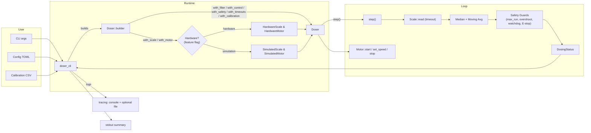
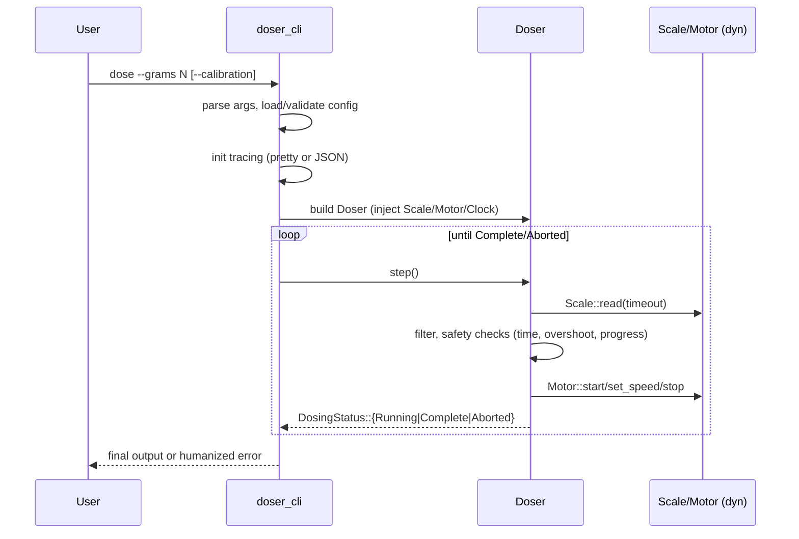
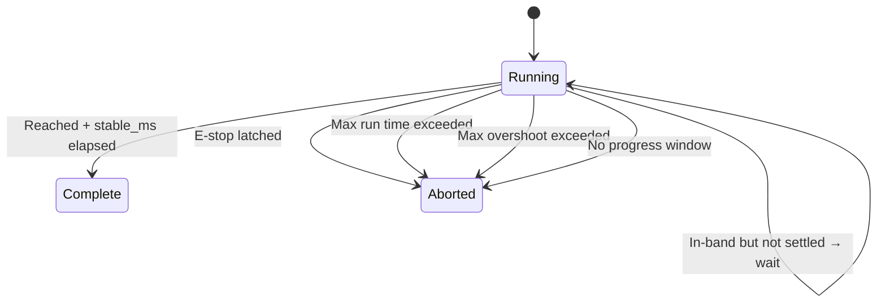

# Doser Architecture

This document describes the architecture of the Doser workspace, its crates, data flow, key Rust features used, and the safety invariants enforced by the core dosing logic.

## Workspace overview

The repository is a Rust workspace composed of multiple crates:

- doser_core: Hardware‑agnostic dosing logic (control loop, filtering, calibration, safety checks, state machine, builder).
- doser_traits: Thin abstraction layer defining hardware traits: Scale and Motor, plus a Clock abstraction (MonotonicClock by default).
- doser_hardware: Hardware backends and a simulation backend. Includes an E‑stop checker factory for GPIO (feature‑gated) and simulated motor/scale. Provides:
  - HardwareScale wrapping an HX711 driver with timeout reads.
  - HardwareMotor (Raspberry Pi step/dir with optional active‑low EN pin) driven from a background thread up to ~5 kHz.
- doser_config: Typed configuration loader (TOML) and calibration CSV loader.
- doser_cli: CLI application that wires config, hardware or sim, and runs a dosing session.
  Initializes logging, and hosts the `monitor` web UI and the `motor` jog command.

(There is no `doser_ui` crate; the workspace members are the five crates above.)

Support files:

- doser_cli/examples/: `quick_start`, `simulated_hardware`, `custom_strategy` — run with
  `cargo run -p doser_cli --example <name>`. They are ordinary cargo example targets, so CI's
  `--all-targets` builds them.
- doser_hardware/examples/hx711_probe.rs: the authoritative HX711 bring-up probe
  (`--features hardware`, Pi only).
- doser_core/benches/predictor.rs: Criterion bench (`harness = false`), run manually.
- fuzz/: cargo-fuzz target for the config loader, run manually.
- .github/workflows/: CI for fmt, clippy, tests, and hardware feature compile checks; a
  daily security workflow; and a tag-triggered release workflow.

## High‑level data flow



## Core (doser_core)

The `Doser` struct implements the dosing control loop. It is built via a `DoserBuilder`, which injects:

- Scale and Motor implementations (via `doser_traits`).
- FilterCfg, ControlCfg, SafetyCfg, Timeouts.
- Calibration (linear mapping counts→grams, plus tare counts).
- Optional E‑stop checker callback (debounced and latched until begin()).
- Optional Clock (for deterministic time‑based tests; default `MonotonicClock`).
- Type‑state builder with validation in `try_build()`.

Completion logic:

- Asymmetric stop threshold: stop motor once `w + epsilon_g >= target`.
- Stability: require `|err| <= max(epsilon_g, hysteresis_g)` for `stable_ms`; an out-of-band
  reading resets the settle timer.
- If the weight falls back below `target - epsilon_g` after the motor was stopped (a settle
  dip, or a predictor early stop that plateaus short), the motor is **restarted** to top the
  dose up, and the no-progress deadline is re-armed at that moment.

### Time and determinism

- A `Clock` trait provides monotonic time and helpers: `now() -> Instant`, `sleep(Duration)`, and `ms_since(epoch: Instant) -> u64`.
- `MonotonicClock` is the default; tests can inject `TestClock`.

### Safety invariants

- E‑stop debounce + latch until `begin()`.
- Hard max runtime, max overshoot guard, and a no‑progress watchdog (`no_progress_epsilon_g` over `no_progress_ms`).

## Config (doser_config)

- Typed TOML with validation in `Config::validate()` and sensible defaults.
- Strict calibration CSV loader: exact header `raw,grams`; at least 2 rows; raw values must be strictly monotonic; OLS fit computes `scale_factor` and `offset` (tare counts).

## CLI (doser_cli)

- Clap CLI: `dose`, `health`, `self-check`, `monitor`, `motor`.
  - `health` reads the scale once and starts/stops the motor.
  - `self-check` only reads the scale for 1 s and reports the detected HX711 rate.
  - `monitor` serves a self-contained live-weight web page over `tiny_http` (no async
    runtime): a reader thread publishes into atomics, handlers serve `GET /reading` and the
    header-gated `POST /tare`, `POST /tare/clear`.
  - `motor` jogs the motor at a fixed rate with no scale and no control loop.
- Logging via tracing + EnvFilter; console pretty or JSON — **both on stderr** — plus an
  optional file sink with rotation and a WorkerGuard kept in a OnceLock. stdout is reserved
  for the CLI's own result/status lines.
- The dose loop lives in `doser_core::runner`; the CLI calls `run_observed` for both the
  plain and the `--stats` path, so the safety watchdogs are identical on both.
- Maps core errors to human‑friendly messages on stderr and to stable exit codes
  (2 E-stop, 3 no-progress, 4 max-runtime, 5 overshoot, 6 max-attempts).

## Error model

- Libraries use `thiserror` for domain errors; the CLI and app edges use `eyre` for ergonomic propagation and context.

## Testing

- Unit tests in `doser_core` with `rstest` and deterministic clocks.
- CLI integration tests use `assert_cmd` and validate stderr for errors.

## Diagrams

Sequence: dose command → control loop



Core state machine



## Local setup and simulation

You can run everything locally without GPIO using the built-in simulator.

- Install Rust (stable)

```bash
curl --proto '=https' --tlsv1.2 -sSf https://sh.rustup.rs | sh
```

- Clone and run a precise simulated dose (no hardware):

```bash
DOSER_TEST_SIM_INC=0.01 cargo run -p doser_cli -- \
  --config ./doser_config.toml --log-level info dose --grams 10
```

- Faster simulation (less precise, still close to target):

```bash
DOSER_TEST_SIM_INC=0.02 cargo run -p doser_cli -- \
  --config ./doser_config.toml --log-level info dose --grams 10
```

- Quick checks (simulation backend):

```bash
# scale + motor reachable → "Health check: OK"
cargo run -p doser_cli -- --config ./doser_config.toml health

# scale sample rate → "Detected HX711 rate: 80 SPS" (never touches the motor)
cargo run -p doser_cli -- --config ./doser_config.toml self-check
```

Notes:

- Place global flags (`--config`, `--calibration`, `--json`, `--log-level`) **before** the
  subcommand; the subcommand's own flags (e.g. `--grams`) after it.
- `health` is the command that prints `OK`; `self-check` prints the detected rate only.
- The simulator only increases weight while the motor is running; it stops once the controller stops the motor.
- `DOSER_TEST_SIM_INC` between 0.005 and 0.02 is the range that reliably converges with the
  root `doser_config.toml`; much larger increments step past the settle band and can trip the
  max-runtime guard.
- For precision tuning guidance, see the README “Precision tuning” section.

### Raspberry Pi hardware (feature-gated)

On a Pi (Linux), enable the hardware feature to use GPIO/HX711 and the step/dir motor driver:

```bash
# Probe scale + motor (brief start/stop)
cargo run -p doser_cli --features hardware -- \
  --config ./etc/doser_config.toml health

# Motor only, no scale and no control loop (bring-up)
cargo run -p doser_cli --features hardware -- \
  --config ./etc/doser_config.toml motor --sps 400 --ms 2000

# Real dose
cargo run -p doser_cli --features hardware -- \
  --config ./etc/doser_config.toml dose --grams 10
```
